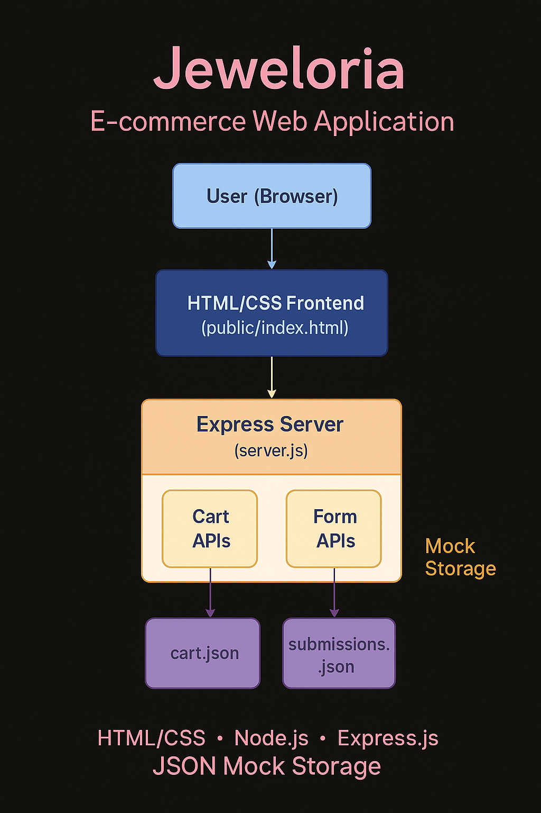

# 💎 Jeweloria – Full-Stack E-commerce Web Application

A responsive, full-stack e-commerce application for a fictional jewelry brand built with **Node.js**, **Express.js**, **HTML**, and **CSS**. Designed to simulate a real-world shopping experience including cart management, form submission, and mock product data handling.

---

## ✨ Project Highlights

- 🔧 Built from scratch with a focus on backend logic and clean API design.
- 🛍️ Simulates core features of modern e-commerce platforms (cart, order, submission).
- 🎨 Responsive frontend with pure HTML & CSS for a clean and elegant look.
- 🧪 JSON-based data handling to mock real database operations.
- 🧩 Easily extendable to React, MongoDB, and authentication.

---

## 🚀 Features

- 🛒 Add to cart & view cart functionality
- 📨 Form submission handling with local storage
- 🔁 RESTful APIs built with Express.js
- 📄 JSON-driven product and submission data
- 📁 Organized folder structure for scalability
- 🌐 Runs locally with simple setup

---

## 🛠 Tech Stack

| Technology | Role             |
|------------|------------------|
| Node.js    | Backend runtime  |
| Express.js | Web server & APIs|
| HTML       | Frontend UI      |
| CSS        | Styling          |
| JSON       | Mock data store  |


---

## ⚙️ Installation & Running the App

```bash
# Clone the repository
git clone https://github.com/your-username/Jeweloria.git
cd Jeweloria

# Install dependencies
npm install

# Start the server
node server.js
Then open your browser at:
➡️ http://localhost:3000

🧠 What I Learned
Backend routing and API creation using Express

Frontend-backend communication using mock JSON data

File structuring and modular code organization

Simulating real-world application logic in a simplified stack


## 📐 Architecture Diagram




